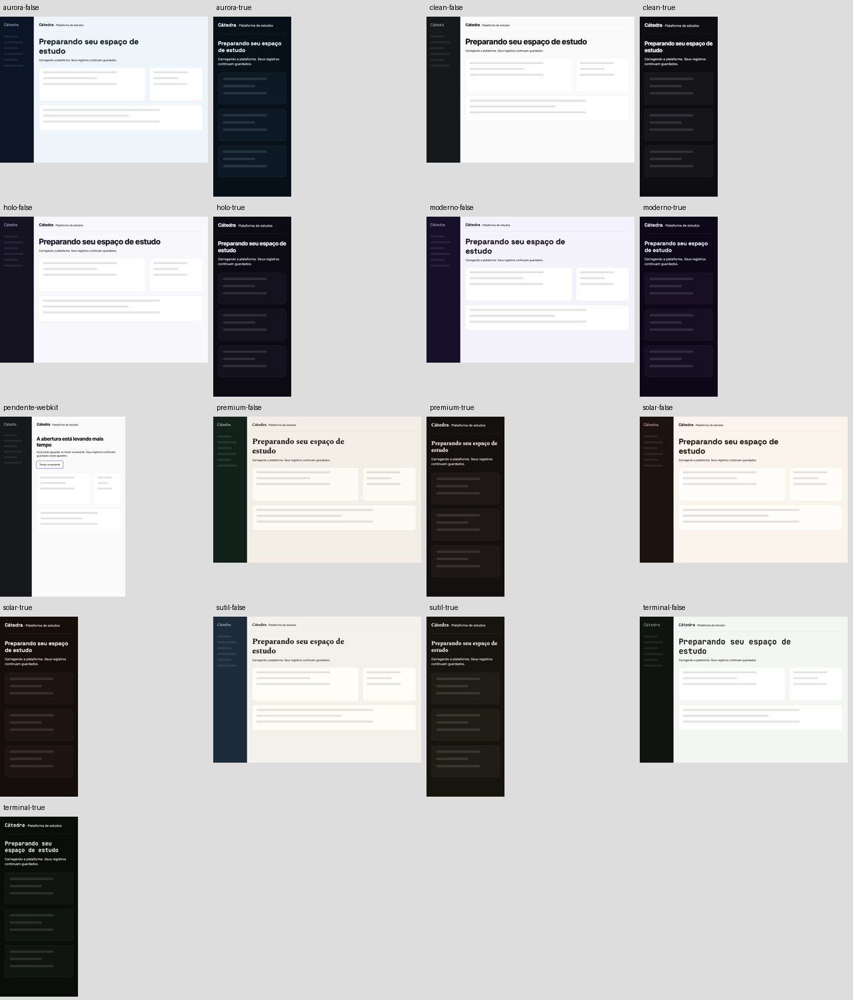
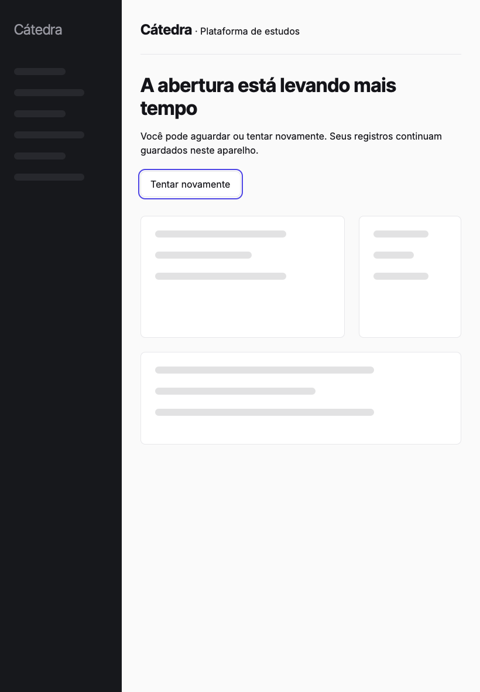

# Mission 001 — abertura com recuperação e proteção de teclado

## Contrato e base

Pedido de 08/10/2026: branch + PR, sem main, merge, deploy ou instalação. Base
`f6ef348f2f42f8f7d95560fdc9e585af99891ed3`, origin/main atualizada antes do trabalho.
Branch `codex/mission-001-abertura`; worktree isolada fora do iCloud. O clone original
continha alterações concorrentes e não foi editado. Na consulta inicial, PR #200
(sentinela/atualizacoes) era o único aberto; worktrees anteriores de P20 foram observadas,
sem reaplicar seus snapshots. Core v0.6.0 ausente em `/mnt/data`; nenhuma dependência dele.

Lidos: CLAUDE.md, PRODUCT.md, DESIGN.md, regras de docs/especificacao-melhorias.md,
roadmap, pedidos-claude-code (P20), brief route-ciclo e a skill Mission Control com gates
de engenharia, design, segurança e release. A proibição expressa de instalação nesta
missão prevalece sobre a regra antiga do CLAUDE.md.

## Diagnóstico e blueprint

A main já embute a casca, deriva as oito paletas do THEMES(), adia scripts e aguarda
CSS completo + main real. Não reconstruir arquitetura nem repetir essas melhorias.
Problema reproduzível: recurso silenciosamente pendente deixa a casca sem saída, pois
só error/unhandledrejection ofereciam recuperação. Durante a casca, o root também
podia receber foco de teclado, mesmo coberto visualmente.

Alteração mínima: após 20 segundos, explicar a demora e oferecer recarga real. O prazo
é de recuperação, não um objetivo de performance nem autorização para exibir o app.
Resposta tardia continua concluindo a abertura. `inert` protege apenas dc-root enquanto
a casca existe, preservando um inert anterior e o portão independente de auth.

`window.CT_ABERTURA_METRICAS` registra início, prontidão do DOM/CSS, duração e estado em
memória. Prontidão do DOM/CSS não equivale a login, hidratação da nuvem ou início do estudo.
Não há identificadores, conteúdo, localStorage, envio de telemetria ou novo esquema de
sync. Timer e listeners são limpos ao concluir; falha explícita cancela o prazo.

## Preservação e segurança

Sem alterações em auth.js, autosave, ARRAY_ID, preferências, temas, cronômetro, retomada
ou acervos. Não há migração. Novo script de medição é ferramenta de teste, não recurso
do aplicativo; carregamento-inicial.js já está nas duas listas de build.

Fronteira tocada: documento/runtime → root visível/interativo. Risco mitigado: teclado
alcançar controles durante montagem incompleta. Casca → auth conserva portão e prioridade.
Browser → storage/sync permanece sem novas gravações/chamadas. RLS, servidores, credenciais,
contas reais e produção não foram modificados nem submetidos a testes intrusivos.

`vercel.json` desativa auto-deploy SOMENTE para a branch desta missão, antes do primeiro
push. Referência: https://vercel.com/docs/project-configuration/git-configuration .
Outras branches mantêm política anterior. Nenhum comando de deploy ou instalação.

## Medição

`node tests/medir-abertura.mjs` contra build local, três contextos frios a 390×844.
Chromium/CDP: latência 150 ms, download 200000 bytes/s (1,6 Mbps), upload 93750 bytes/s,
CPU 4×. Não é Lighthouse, nem aparelho físico, nem produção. Sem conta real.
LCP amostrado após main + retirada da casca e mais 500 ms; representa essa janela, não
um valor final após todas as interações. A medição histórica de 23/09 não é baseline.

A execução inicial ocorreu com suítes concorrentes; comparação tem ruído de contenção
e não fundamenta promessa de aceleração. Para benchmark de performance, repetir serialmente
em máquina ociosa, Lighthouse + perfil de trace. Esta entrega é recuperação e instrumentação.

## Validação, gates e limites

Resultados finais registrados abaixo após execução. Capturas e JSONs acompanham o pacote
transferível. Suítes existentes cobrem login, hidratação, merge, retomada e modo file://;
testes novos cobrem silêncio, teclado, preservação, resposta tardia, recarga e oito temas.

Dispositivos reais Mac/iPad e instalação: NOT RUN, fora da autorização. Playwright WebKit
é proxy de JavaScriptCore, não prova física em WKWebView/SwiftUI. Lighthouse/TBT: NOT RUN.
O fluxo real de produção com conta e sincronização entre dispositivos: NOT RUN.

## Risco residual e rollback

Prazo de 20s pode surgir numa carga legitimamente lenta; texto permite continuar aguardando
sem chamar a demora de falha. Timer não interrompe CPU síncrona. `inert` exige engine atual;
validado em Chromium/WebKit, validação física permanece necessária antes de release.
Nenhuma alegação de pentest ou segurança integral.

Rollback: fechar PR sem merge deixa produção intacta; numa futura integração autorizada,
reverter o commit desta missão restaura casca anterior. Sem dados novos para migrar ou apagar.
Não remover dados/cache do estudante como parte de recuperação.

## Amostras atualizadas (ms)

| Perfil | LCP 1 | LCP 2 | LCP 3 | Mediana |
|---|---:|---:|---:|---:|
| Base | 19840 | 18412 | 19832 | 19832 |
| Alteração | 18864 | 18864 | 19908 | 18864 |

A diferença é pequena frente ao ruído; não há redução de LCP demonstrada.
A instrumentação da alteração registrou prontidão do DOM/CSS em 17242, 17902, 18653 ms desde a casca.

Maiores subrecursos transferidos no primeiro boot da base (não inclui documento de navegação):

- `/public/vendor/supabase.js`: 218537 bytes.
- `/public/catedra-ui.css`: 147176 bytes.
- `/public/vendor/react-dom.js`: 132135 bytes.
- `/public/auth.js`: 117780 bytes.
- `/public/support.js`: 58520 bytes.

A lista registra o custo dos subrecursos. Documento, parse e runtime exigem um próximo trace.
Não atribuímos causalidade à transferência sem decompor CPU/parse/render.

## Prova controlada do problema

WebKit, runtime substituído por recurso indisponível sem erro, relógio simulado em
21.000 ms: base f6ef348 mantém casca e oferece 0 botões de recuperação; alteração
mantém casca e oferece 1 botão. O teste de recarga confirma navegação real e edital
local preservado. Foco programático num controle coberto: permitido na base e
bloqueado na alteração (medido com document.activeElement no WebKit). Nenhuma
tentativa de abrir dados antes do CSS/runtime pronto.

Checagens de branch: main exige PR e contextos `testes` e `Testes WebKit (Safari)`;
force push desabilitado. Segunda consulta da main antes da entrega ainda em f6ef348.

## Capturas inspecionadas

WebKit, dados sintéticos: oito direções em claro a 1280 px e escuro a 390 px.
Sem faixa lateral colorida nova, overflow ou mudança de tipografia/paleta; a casca
continua usando a tabela THEMES() do produto. Matriz visual e contraste medido no teste.

Recuperação a 820×1180, foco visível no botão; captura real do cenário pendente:

## Resultado final dos gates locais

| Gate | Resultado |
|---|---|
| `npm test` | **BLOCKED**: 4516 linhas de verificações aprovadas, nenhuma falha registrada; mais de 25 minutos sem progresso após AUTH HIDRATAÇÃO (g), encerrado pelo executor. Não certificado como PASS. |
| `CT_PORT=8142 npm run test:webkit` | **PASS**, exit 0, 2905 linhas de verificações aprovadas, nenhuma falha. |
| Testes específicos de abertura, resposta tardia e recarga | **PASS**, Chromium/WebKit; provas e capturas descritas acima. |
| `npm run build` | **PASS**. |
| `node scripts/build-macos.mjs` | **PASS**; somente geração do bundle web, sem instalação ou build de aplicativo. |
| `node scripts/verificar-segredos.mjs` | **PASS**. |
| `node scripts/verificar-design-nativo.mjs` | **PASS**. |
| `node tests/inicio-enxuto.mjs` | **PASS**. |
| `node tests/ciclo-sessao-intencional.mjs` | **PASS**; pausa e retomada preservadas. |
| Smoke offline WebKit HTTP e file:// | **PASS**; LEGIS/JURIS/PDF, sem dependências externas não autorizadas. |
| Sintaxe JS e `git diff --check` | **PASS**. |
| WKWebView físico Mac/iPad, instalação e sincronização real | **NOT RUN**, limite expresso desta missão. |
| Lighthouse/TBT e produção com conta real | **NOT RUN**. |
| CI do PR | A verificar no commit enviado; a aprovação local completa de Chromium continua bloqueada. |

Tentativa inicial de WebKit em 8124: **BLOCKED** por porta ocupada, resolvida usando 8142.
Execuções exploratórias interrompidas antes da rodada final não contam como suítes aprovadas.
O build mantém aviso preexistente de Termos/Política em rascunho; nenhuma alteração nesses documentos.
Este PR não está certificado para integração enquanto o gate Chromium permanecer sem conclusão.

A regra de CLAUDE.md exige as duas suítes verdes antes do commit. Ela não foi
satisfeita pelo Chromium travado. A solicitação expressa desta missão admite
registrar gates BLOCKED/NOT RUN e exige uma entrega transferível: este envio será
um **PR em rascunho**, com a exceção declarada, sem aprovação para merge/release.
